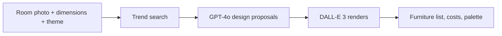

# AI Room Designer

**Upload a photo of an empty room, pick a theme, and get design proposals with renders, furniture lists, costs and color palettes in Italian and English.**

    



## Problem it solves

Imagining a furnished room from an empty photo is hard, and interior designers are expensive. This app combines current trend research with GPT-4o proposals and DALL-E 3 renders, and learns which designs users pick.

**Design your dream room with AI.** Upload a photo of your empty room, pick a theme, and get 5 photorealistic designs with furniture lists, costs, and color palettes — in Italian and English.

## Features
- Upload room photo + set dimensions
- 11 design themes (Modern, Rustic, Industrial, Boho, Japanese, etc.)
- Web search for current design trends (IKEA, Pinterest, top styles)
- GPT-4o generates 5 unique design proposals
- DALL-E 3 photorealistic renders
- Furniture & decor list with estimated costs
- Color palette with hex codes
- Design rationale in Italian + English
- Self-improving — learns which designs users pick most
- Auto-evolve: trend report every 100 picks (sellable to furniture stores)

## Quick Start
```bash
pip install -r requirements.txt
cp .env.example .env   # add your OPENAI_API_KEY
python main.py
# Open http://localhost:8000
```

## Room Types
| Type | Emoji |
|------|-------|
| Bathroom |  |
| Bedroom |  |
| Kitchen |  |
| Living Room |  |
| Office |  |

## Themes
Modern · Rustic · Industrial · Boho · Classic · Japanese · Mediterranean · Vintage · Scandinavian · Minimalist · Eclectic · Custom

## Auto-Evolve
After 100 user picks, the system generates a design trend report per room category — showing top themes, popular colors, avg costs. This report can be sold to furniture stores and renovation companies.

## Tech Stack
FastAPI · SQLite · OpenAI GPT-4o + DALL-E 3 · Jinja2 · Dark Theme UI
